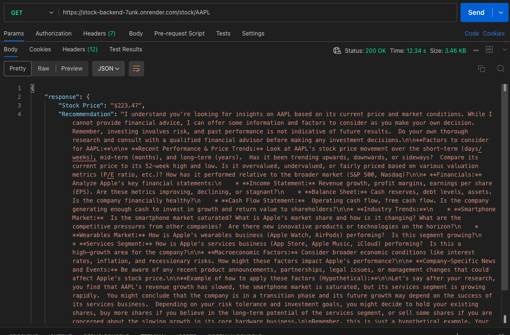

Important note: When testing the API, it can take upto 50 seconds to get the initial response because the backend has been deployed using a free tier of Render (https://render.com/) after which it will give quick responses. This is due to render scaling down free tier services after a period of inactivity.

This project is a Stock Market Agent that uses AI to fetch real time stock prices and provide Buy/Sell/Hold recommendations based on the latest stock trends. The agent is built using Python,FastAPI,LangChain and Gemini API (Google AI). It is deployed on a public server (Render). The link for the deployed backend is here: https://stock-backend-7unk.onrender.com/

Since it is deployed on a free tier of render, initial response for a get request can take up to 50 seconds after which responses come quickly when made.

This project fetches real time stock prices using Yahoo Finances' python module called yfinance and uses LangChain for intelligent response generation. It exposes a REST API that returns stock data and analysis, making it accessible for integration with other applications. A prompt is sent to fetch the stock price and then provide Buy, Sell, or Hold recommendations from Google Gemini.

1. API Endpoints:

GET /stock/{ticker} - Fetch Stock Price & Recommendation - https://stock-backend-7unk.onrender.com/stock/{ticker}
   
Description: Fetches the latest stock price for a given ticker symbol and provides a Buy/Sell/Hold recommendation.

Method: GET

Path Parameter:

ticker (string): The stock symbol (e.g., AAPL for Apple - https://stock-backend-7unk.onrender.com/stock/AAPL).

Example usage in postman with GET request:

https://stock-backend-7unk.onrender.com/stock/AAPL 

response": {
        "Stock Price": "$223.47",
        "Recommendation": <Gemini recommendation>
        }

The stock price is fetched using yahoo finance (yfinance) and the recommendation is given using Gemini. Most LLMs are trained not to give financial advice which is why the advice given by Gemini is mostly generic and not based on the actual changes in the stock price.

2. Installed Python Modules:

fastapi - Web framework for building the API. It helps create RESTful endpoints for fetching stock prices and recommendations.

uvicorn - ASGI server used to run the FastAPI application. It allows the API to be accessed over the internet.

requests - Used for making HTTP requests to fetch stock prices from external APIs such as Yahoo Finance or search engines.

google-generativeai - Connects to Google Gemini API, allowing the AI to generate stock market analysis and recommendations.

langchain - A framework for developing AI powered responses. It helps structure interactions with LLMs for better efficiency.

yfinance - Fetches real time and historical stock market data directly from Yahoo Finance.

3. Project Structure
│── app/
│   │── main.py             # FastAPI app (API endpoint)
│   │── agent.py            # AI agent logic (LLM-based analysis)
│   │── stock_fetcher.py    # Fetches stock prices from search API
│   │── config.py           # API keys & environment variables
│── requirements.txt        # Dependencies
│── README.md              # Project setup & execution guide

4. Setup

First we create a virtual environment to run the app

python -m venv venv
source venv/bin/activate  # On macOS/Linux

Then we install all the dependencies 

pip install fastapi uvicorn requests google-generativeai langchain openai beautifulsoup4 duckduckgo-search httpx yfinance python-dotenv

We create a .env file to place our gemini API key
GOOGLE_API_KEY=your_api_key_here

The following is a description of the created .py files under the app folder.

agent.py
Handles the AI based stock market analysis by fetching stock prices using the function defined in the stock_fetcher.py file and generates recommendations using the Gemini API.

config.py
Loads environment variable which in our case is the Gemini API key from the .env file.

main.py
Defines FastAPI endpoints to fetch stock prices and AI recommendations. Runs the server using Uvicorn.

stock_fetcher.py
Fetches real-time stock prices using Yahoo Finance (yfinance)

Then we start the FastAPI server 
uvicorn main:app --host 0.0.0.0 --port 8000

We can use postman to now test the GET API - https://stock-backend-7unk.onrender.com/stock/{ticker}

To deploy globally I have used Render. 
To deploy on Render:

1. Go to https://dashboard.render.com/
2. Click new web service then connect gitHub repository where you choose the github repository with the FastAPI app.
3. Set build command: pip install -r requirements.txt
4. Set start command: uvicorn main:app --host 0.0.0.0 --port $PORT
5. Add environment variable GOOGLE_API_KEY=your_api_key_here
6. Click deploy

